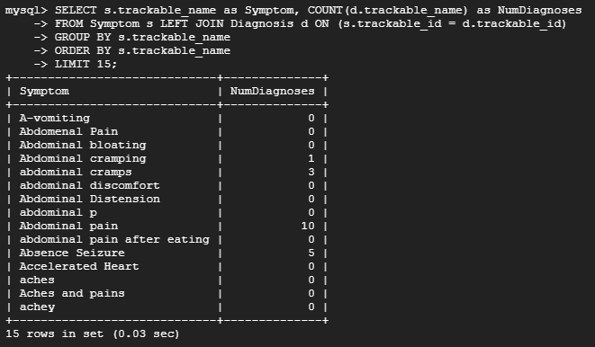
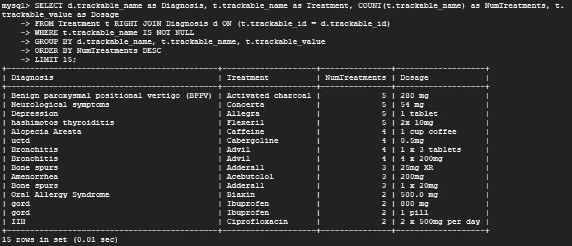
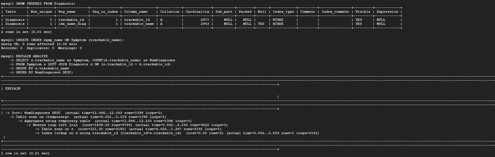
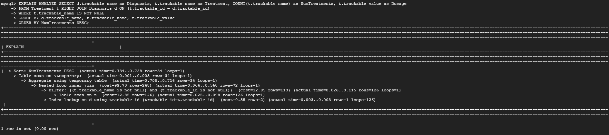
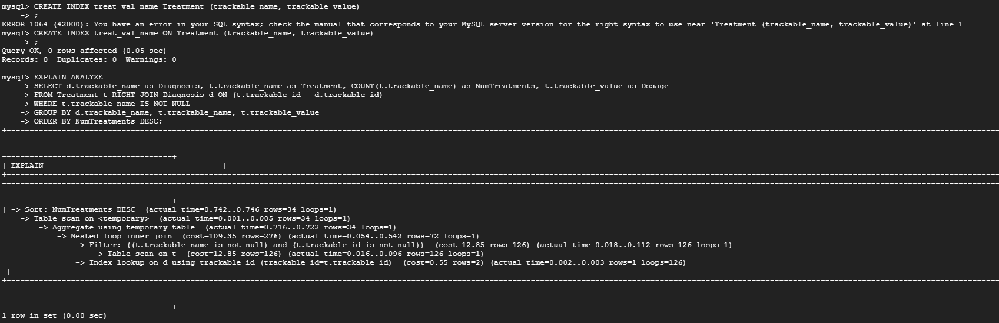
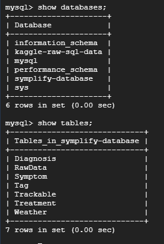
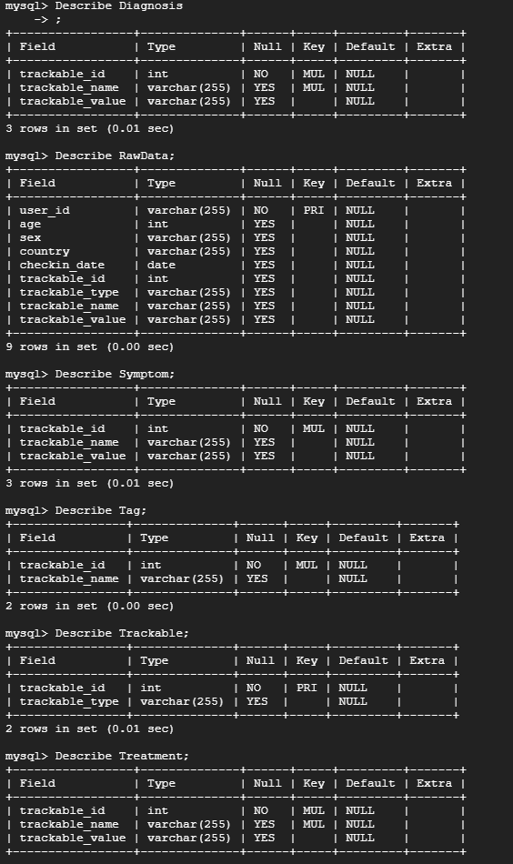
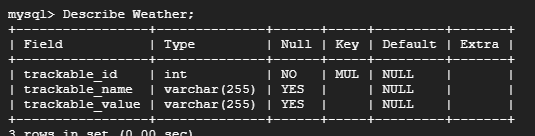
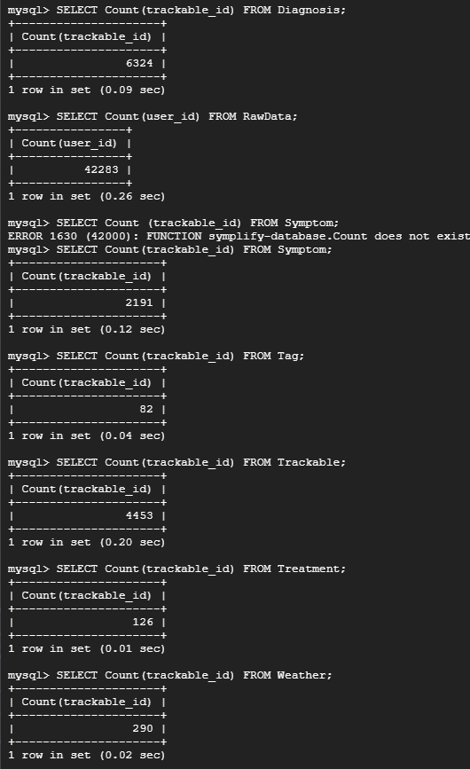

# DDL Commands
```SQL
CREATE TABLE KaggleTopLevel (
user_id VARCHAR(255) NOT NULL,
age INT,
sex VARCHAR(255),
country VARCHAR(255),
checkin_date Date,
trackable_id INT,
trackable_type VARCHAR(255),
trackable_name VARCHAR(255),
trackable_value VARCHAR(255),
PRIMARY KEY(user_id)
);

CREATE TABLE Diagnosis (
trackable_id INT NOT NULL,
trackable_name VARCHAR(255),
trackable_value VARCHAR(255),
FOREIGN KEY (trackable_id) REFERENCES Trackable(trackable_id)
);

CREATE TABLE Symptom (
trackable_id INT NOT NULL,
trackable_name VARCHAR(255),
trackable_value VARCHAR(255),
FOREIGN KEY (trackable_id) REFERENCES Trackable(trackable_id)
);

CREATE TABLE Treatment (
trackable_id INT NOT NULL,
trackable_name VARCHAR(255),
trackable_value VARCHAR(255),
FOREIGN KEY (trackable_id) REFERENCES Trackable(trackable_id)
);

CREATE TABLE Tag (
trackable_id INT NOT NULL,
trackable_name VARCHAR(255),
FOREIGN KEY (trackable_id) REFERENCES Trackable(trackable_id)
);

CREATE TABLE Weather (
trackable_id INT NOT NULL,
trackable_name VARCHAR(255),
trackable_value VARCHAR(255),
FOREIGN KEY (trackable_id) REFERENCES Trackable(trackable_id)
);

CREATE TABLE Trackable (
trackable_id INT NOT NULL,
trackable_type VARCHAR(255),
PRIMARY KEY (trackable_id)
);

CREATE TABLE User (
user_id VARCHAR(255) NOT NULL,
username VARCHAR(255),
password VARCHAR(255),
email VARCHAR(255),
PRIMARY KEY(user_id)
);

CREATE TABLE Demographics (
user_id VARCHAR(255),
age INT,
sex VARCHAR(255),
country VARCHAR(255),
FOREIGN KEY (user_id) REFERENCES User(user_id),
PRIMARY KEY(user_id)
);

CREATE TABLE UserTracks (
trackable_id INT,
user_id VARCHAR(255),
FOREIGN KEY (trackable_id) REFERENCES Trackable(trackable_id),
FOREIGN KEY (user_id) REFERENCES User(user_id)
);

```

# Advanced Queries
## Query 1
Determine the number of diagnoses related to each sympton.
```SQL
SELECT s.trackable_name as Symptom, COUNT(d.trackable_name) as NumDiagnoses
FROM Symptom s LEFT JOIN Diagnosis d ON (s.trackable_id = d.trackable_id)
GROUP BY s.trackable_name
ORDER BY NumDiagnoses DESC
LIMIT 15;
```


## Query 2
Determine the number of treatments related to each diagnosis, also displaying the dosage used.
```SQL
SELECT d.trackable_name as Diagnosis, t.trackable_name as Treatment, COUNT(t.trackable_name) as NumTreatments, t.trackable_value as Dosage
FROM Treatment t RIGHT JOIN Diagnosis d ON (t.trackable_id = d.trackable_id)
WHERE t.trackable_name IS NOT NULL
GROUP BY d.trackable_name, t.trackable_name, t.trackable_value
ORDER BY NumTreatments DESC
LIMIT 15;
```


# Indexing
## Query 1
Here is our analysis before indexing. There is an index seen here because we have a foreign key:


Here is our analysis after adding an index on Symptom trackable_name. We noticed that we were querying for many trackable_names such as Nausea and other Symptoms so we decided to index on the trackable_name to make diagnosis lookup faster. Now, the query only needs to look in this attribute instead of a full table. We saw a decrease in the upperbound table scan time as a result. That being said, this index did not have much effect on the overall querying time. 


Here is our analysis after adding an index on Diagnosis trackable_name. We noticed that the same was true with out Diagnosis table, and that we were querying for trackable_names here such as Depression. We used an index on trackable_name to avoid the query having to query the whole table. That being said, this index did not have much effect on the overall querying time. 


Here is our analysis after adding an index on both Diagnosis trackable_name and Symptom trackable_name. Here, we decided to add both indices to see if we could generate a larger decrease in query time. Unfortunately, we did not see much of a decrease in query time after combining the two indices. It is worth noting that our original query time was pretty low, and our DDL is pretty efficient already. 


## Query 2
Here is our analysis before indexing. There is an index seen here because we have a foreign key:


Here is our analysis after adding an index on Diagnosis trackable_name. As shown below, we notice a slight decrease in time for the nested loop inner join. This is because we chose an attribute that we are joining on. That being said, this index did not have much effect on the overall querying time. 


Here is our analysis after adding an index on Treatment trackable_name, trackable_value. Here, we decreased our table scan time slightly by specifying parts of the table that we were querying for using indexing. This slight increase in efficiency allows for our query time to increase overall. That being said, this index did not have much effect on the overall querying time. 


Here is our analysis after having an index on both Treatment trackable_name, trackable_value and having an index on Diagnosis trackable_name. Here, we did not see an increase in any section with our indexing. This may be because the attributes we chose to index were not used heavily in the query that we are using. It is worth noting that our original query time was pretty low, and our DDL is pretty efficient already. 


## Conclusion
Overall, our indexing strategies were not effective in improving performance. This might be due to how both our queries are structured, performing joins on some columns while directly querying and performing aggregation on other unrelated columns. Aggregation might also make it harder for the SQL engine to apply indexing as there is no obvious pattern in the query results.


## Table Implementation / Insertion
Please see the below screenshots to view the schemas for the implemented tables, as well as the row counts for each table. 








This shows our connection.


